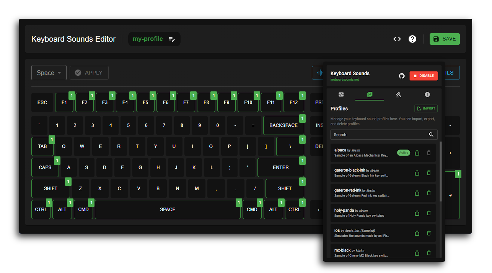

# Keyboard Sounds

Add sound effects to your typing experience.

[](https://github.com/sponsors/nathan-fiscaletti)
[](https://badge.fury.io/py/keyboardsounds)
[](https://github.com/nathan-fiscaletti/keyboardsounds/blob/master/LICENSE)
[](https://pepy.tech/project/keyboardsounds)

[⬇️ Download Desktop Application (Windows Only)](https://github.com/nathan-fiscaletti/keyboardsounds/releases/latest)

Keyboard Sounds is a lightweight system tray application that adds sound effects to your typing experience.

## Features

- [Pre-made Sound Profiles](./keyboardsounds/profiles)

  Comes packaged with a variety of **ready-to-use sound profiles**, perfect for quick setup and customization.

- [Create Custom Profiles](#custom-profiles)

  Includes a **built-in editor** for crafting your own custom sound profiles with ease.

- [Application-Specific Rules](#application-rules)

  Flexible **rules** to enable or disable sound effects for certain applications based on their focus.

- [Command-Line](#command-line)

  Provides a **command-line interface** for advanced users to control and configure the application.

## Installation

Keyboard Sounds can be installed as a desktop application or as a Python package. The desktop application is recommended for most users as it is easier to install and use.

### Desktop Application

[⬇️ Download (Windows Only)](https://github.com/nathan-fiscaletti/keyboardsounds/releases/latest)


Currently the desktop application is only available for **Windows**. The Python package can be used on any platform that supports Python.

The desktop application still requires the Python package to be installed on your system. On first launch, the application will check that both Python and the required Python packages are installed.

  - Make sure when you install Python that you check the box that says **"Add Python to PATH"**. This will allow you to run Python from the command line, which is a requirement for the desktop application to function correctly.

You may need to restart the application after doing this for the changes to take effect.

> For information on uninstalling Keyboard Sounds, see [Uninstall Keyboard Sounds](#uninstalling)

### Install as Python Package

To install this application as a CLI utility via the Python package, you will need to have Python installed on your system. You can download Python from the [official website](https://www.python.org/).

  - Make sure when you install Python that you check the box that says **"Add Python to PATH"**. This will allow you to run Python from the command line.
  - After you have installed Python, you can install the Keyboard Sounds CLI by running the following command in your terminal.

    ```sh
    $ pip install keyboardsounds
    ```

## Custom Profiles

Keyboard Sounds comes bundled with eleven built-in sound profiles and supports custom profiles in which you can provide your own WAV or MP3 files to be used for the different keys pressed.

Read more about creating and editing profiles [here](./docs/custom-profiles.md).



## Application Rules

Keyboard Sounds supports application rules in which you can control the behavior of the sound daemon based on the currently running applications. Read more about application rules [here](./docs/backend.md#managing-application-rules-windows-only)

<p align="center">
  
</p>

## Command Line

<p align="center">
  
</p>

Keyboard Sounds has a comprehensive backend that can be used to manage the daemon, application rules, and profiles. This backend can be accessed via the command line interface (CLI) in your terminal application.

Read more about backend usage [here](./docs/backend.md).

## Uninstalling

You can uninstall the Keyboard Sounds Desktop Application from the "Apps" section of your system Settings application. 

- Uninstalling the desktop app will **not** remove the Python package from your system, you will need to do this manually if you no longer wish to use the Python package using the following command:

  ```sh
  $ pip uninstall keyboardsounds
  ```

## Development

Documentation for developers who wish to contribute to this project can be found [here](./docs/development.md).
